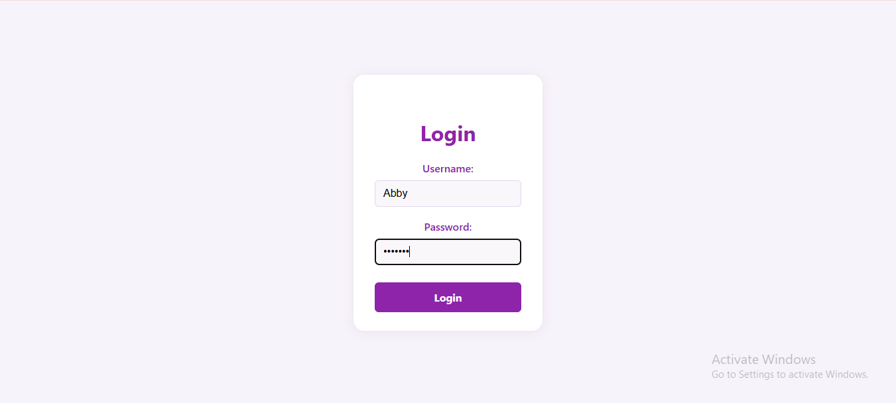
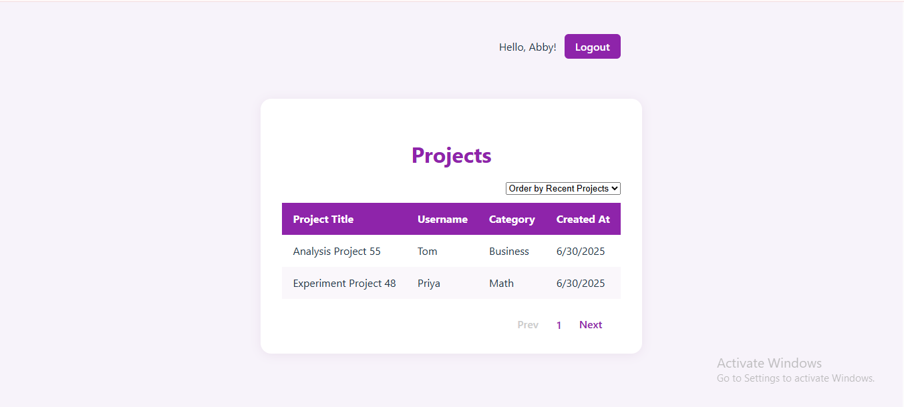

# Fullstack Project Management App

A full-stack project management application built with React (frontend), Node.js/Express (backend), and MongoDB (database).

## Features

- User login/logout with session support
- Paginated and sortable project list (by recent, category, username, title)
- Projects joined with users and categories
- Modern, responsive UI

## Screenshots




## Getting Started (Development)

### Prerequisites

- Node.js (v18 or later recommended)
- npm
- MongoDB (running locally on default port)

### 1. Clone the repository

```
git clone https://github.com/kaikondan25/fullstack-project.git
cd fullstack-project
```

### 2. Install frontend dependencies

```
npm install
```

### 3. Install backend dependencies

```
cd server
npm install
```

### 4. Seed the database with sample data

```
node sampleData.js
```

### 5. Start the backend server

```
node index.js
```

The backend will run on [http://localhost:4000](http://localhost:4000)

### 6. Start the frontend (in a new terminal)

```
cd ..
npm run dev
```

The frontend will run on [http://localhost:5173](http://localhost:5173)

## Default Users

- Abby / abby123
- John / john123
- ... (see `sampleData.js` for more)

## Notes

- Make sure MongoDB is running before seeding data or starting the backend.
